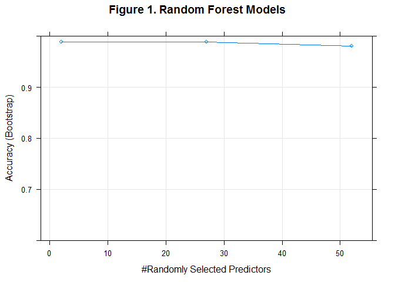
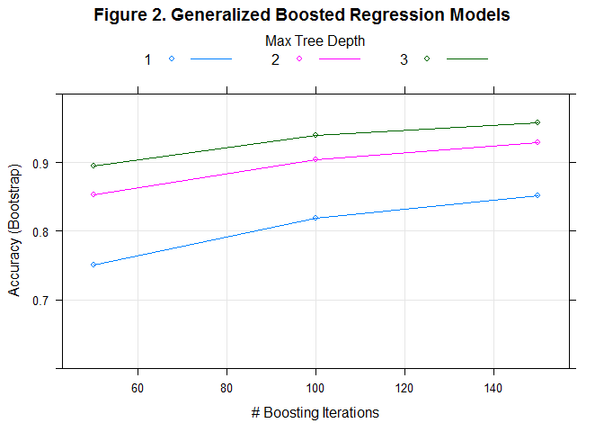

# Practical Machine Learning Project
lujienc  
December 15, 2015  
### Synopsis 

In this project, we use informaton collected from wearable devices attached to six participants' belt, arm, dumbbell, and forearm to understand how well they exercise
by doing a particular activity. We build a few prediction models on training data, select the one with the smallest out-of-sample errors (using testing data), and then apply the selected prediction model on 20 testing cases.  

### Data prepration  

Before training prediction models, we clean the data and select relevant features for subsequent model training and testing.  


```r
library(ggplot2)
library(caret)
```

```
## Loading required package: lattice
```

```r
library(plyr)
library(randomForest)
```

```
## randomForest 4.6-12
## Type rfNews() to see new features/changes/bug fixes.
```

```r
library(gbm)
```

```
## Loading required package: survival
## 
## Attaching package: 'survival'
## 
## The following object is masked from 'package:caret':
## 
##     cluster
## 
## Loading required package: splines
## Loading required package: parallel
## Loaded gbm 2.1.1
```

```r
library(MASS)
setwd("D:/Data Science Certificate/Course 8_Practical Machine Learning/Projects/Practical-Machine-Learning")

## Read original data
trainraw <- read.csv(file="D:/Data Science Certificate/Course 8_Practical Machine Learning/Projects/pml-training.csv", header=TRUE, na.strings=c("NA","#DIV/0!",""))
testraw <- read.csv(file="D:/Data Science Certificate/Course 8_Practical Machine Learning/Projects/pml-testing.csv", header=TRUE, na.strings=c("NA","#DIV/0!",""))
dim(trainraw)
```

```
## [1] 19622   160
```

```r
dim(testraw)
```

```
## [1]  20 160
```
  
Altogether, there are 160 varialbes in the dataset, with 19622 observations in the training data and 20 observations in the testing data.   

Detailed data examination reveals that first 7 varialbes are primarily used for identification and record purposes, offering little value for our predictions. Thus, we drop them.   

Moreover, to ensure sufficient information for making predictions, all variables with more than 10% of missing values are to be excluded.  


```r
## Drop first seven varialbes
trainnew <- trainraw[, -(1:7)]
testnew <- testraw[, -(1:7)]

## Drop varialbes with more than 10% missings
missperg <- apply(is.na(trainnew), 2, mean)
keepindex1 <- missperg<0.1
trainnew <- trainnew[, keepindex1]
testnew <- testnew[, keepindex1]

## Check the number of remaining varialbes with limited variance
nearZeroVar(trainnew)
```

```
## integer(0)
```

```r
dim(trainnew)
```

```
## [1] 19622    53
```

```r
dim(testnew)
```

```
## [1] 20 53
```
  
After cleaning the raw data, we have 52 variables with sufficient variation (besides the outcome varialbe) that could be used to make predictions about how well the six participants exercise.  

To provide appropriate estimations of our prediction models' out-of-sample errors, we randomly separate the training data into two parts for (1) training (70%) and (2) testing (30%) respectively.  


```r
set.seed(12345)
## 70% of raw training data for training prediction models
index1 <- createDataPartition(trainnew$classe, p=0.7, list=FALSE)
trainlocal <- trainnew[index1, ]

## 30% of raw training data for testing prediction models
testlocal <- trainnew[-index1, ]
dim(trainlocal)
```

```
## [1] 13737    53
```

```r
dim(testlocal)
```

```
## [1] 5885   53
```

### Model selection  

For model comparison, we try three different algrithms on the training data: (1) Random Forests (RF), (2) Generalized Boosted Regression Models (GBM) and (3) Linear Discriminant Analysis (LDA).  

First, we train a RF model using the training data.  

```r
set.seed(56789)
fit1 <- train(classe~., method="rf", data=trainlocal)
```
  
Second, we train a GBM model using the training data.

```r
fit2 <- train(classe~., method="gbm", data=trainlocal)
```
  
Third, we train a LDA model using the training data.

```r
fit3 <- train(classe~., method="lda", data=trainlocal)
```
    
To demonstrate the process of training prediction models, we present the details of model training for RF and GBM in the following figures respectively.  


```r
plot(fit1, main="Figure 1. Random Forest Models", ylim=range(0.6,1))
```

 

```r
plot(fit2, main="Figure 2. Generalized Boosted Regression Models", ylim=range(0.6,1))
```

 

Finally, we assess the out-of-sample errors of the three prediction models, using the testing data.  


```r
## Calculating out-of-sample errors
## RF predictions
pred1 <- predict(fit1, newdata=testlocal)

## GBM predictions
pred2 <- predict(fit2, newdata=testlocal)

## LDA predictions
pred3 <- predict(fit3, newdata=testlocal)

## Overall accuracy for RF, GBM, and LDA 
acc1 <- confusionMatrix(pred1, testlocal$classe)
acc2 <- confusionMatrix(pred2, testlocal$classe)
acc3 <- confusionMatrix(pred3, testlocal$classe)
```
  
When applied to the testing data, the three prediction models show the following overall accuracy in their respective predictions:  

- Ramdom Forest: 98.95%
- Generalized Boosted Regression: 95.82%
- Linear Discriminant Analysis: 69.62%  

Accordingly, the expected out-of-sample errors of the three prediction models are:  

- Random Forest: 1.05%
- Generalized Boosted Regression: 4.18%
- Linear Discriminant Analysis: 30.38% 

Given the aforementioned results, we decide to use the Random Forest model for making final preciditnos, thanks to its smallest out-of-sample errors among the three models.  

### Generating predictions  

As previous discussions suggest, Random Forest (RF) provides the most accurate precitions on our tetsing data. Therefore, we apply the RF model trained on our training data to the 20 testing cases. 


```r
## Making predictions
finalpred <- predict(fit1, newdata=testnew)
finalpred
```

```
##  [1] B A B A A E D B A A B C B A E E A B B B
## Levels: A B C D E
```

```r
## Writing the precitions to txt files for submissions
pml_write_files = function(x){
    n = length(x)
    for(i in 1:n){
        filename = paste0("problem_id_",i,".txt")
        write.table(x[i],file=filename,quote=FALSE,row.names=FALSE,col.names=FALSE)
    }
}

pml_write_files(finalpred)
```
